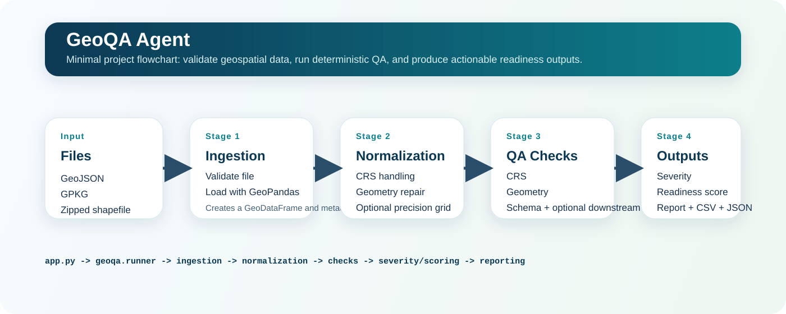

# GeoQA Agent

GeoQA Agent validates geospatial files, normalizes their geometry and CRS, runs deterministic QA checks, assigns severity, computes a readiness score, and writes a report plus issue CSV.

## Project infographic



## Architecture at a glance

1. `app.py` parses the CLI request and forwards runtime options into `geoqa.runner.run_geoqa(...)`.
2. `geoqa/ingestion` validates the incoming file and loads it into a GeoPandas `GeoDataFrame`.
3. `geoqa/normalization` optionally reprojects CRS, repairs invalid geometries, and snaps precision to a grid.
4. `geoqa/checks` runs deterministic QA rules across CRS, geometry, schema, SQL Server compatibility, and linear referencing.
5. `geoqa/severity` maps issue codes to severities and suggested fixes, while `geoqa/scoring` computes a readiness score.
6. `geoqa/reporting` writes the run artifacts and `geoqa/ops/run_logger.py` appends an operational log entry.

## Supported inputs

- `.geojson`
- `.gpkg`
- zipped shapefile

## Quick start

```bash
python app.py path/to/data.geojson --required-column asset_id
```

Artifacts are written to `outputs/<run_id>/`:

- `qa_report.md`
- `issues.csv`
- `run_record.json`
- `summary.json`

## Checks in v1

- CRS presence and coordinate plausibility
- geometry validity, empties, duplicates, mixed types, overlaps, suspicious feature sizes
- required schema columns, null-heavy columns, duplicate feature IDs
- optional SQL Server compatibility checks
- optional linear reference checks
