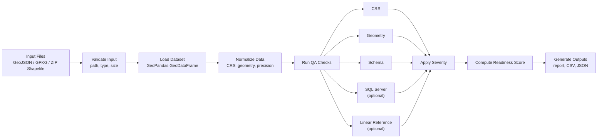
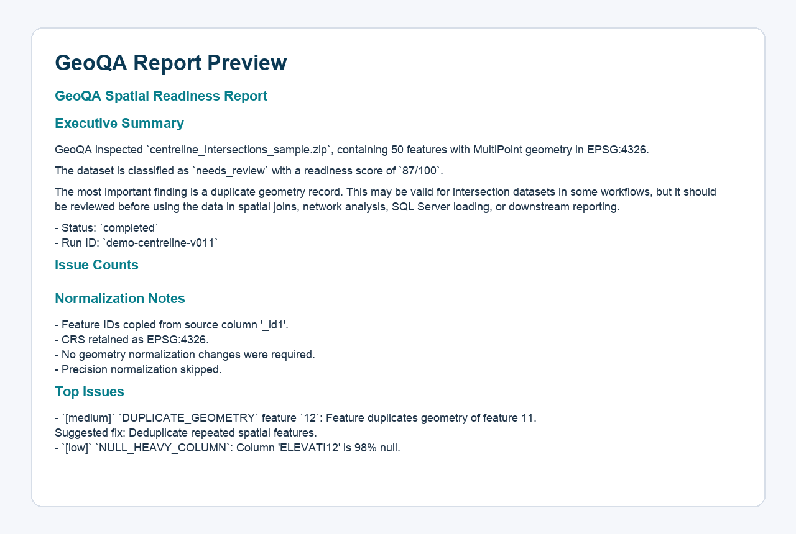
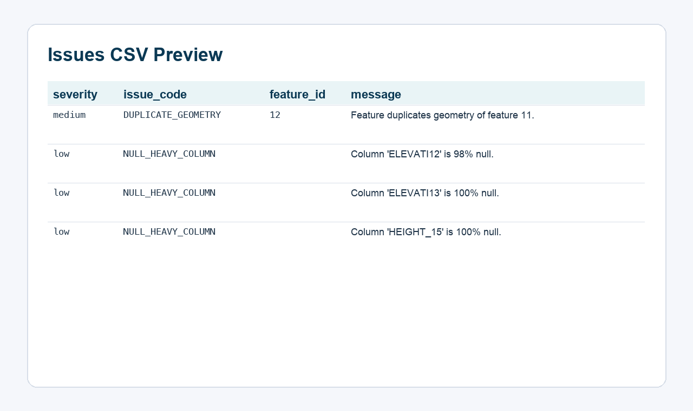
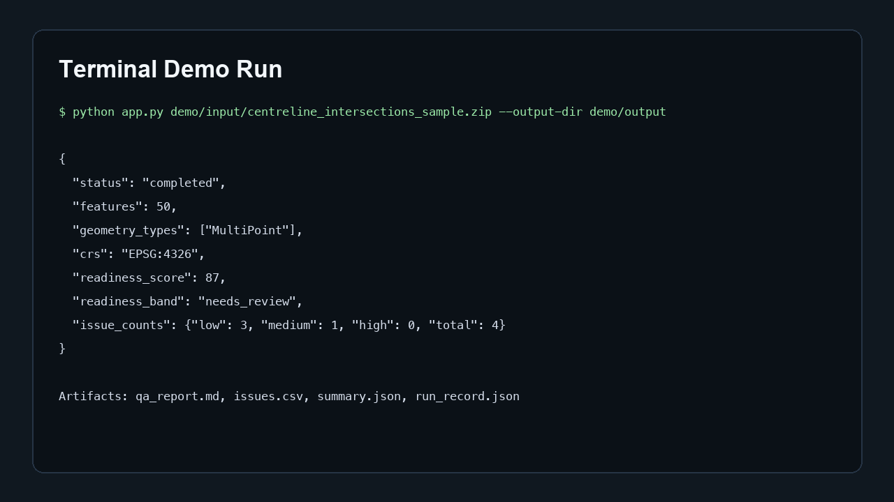

# GeoQA Agent

GeoQA Agent validates geospatial files, normalizes their geometry and CRS, runs deterministic QA checks, assigns severity, computes a readiness score, and writes a report plus issue CSV.

## Why GeoQA Agent?

GIS and infrastructure teams often discover data quality problems too late: during database loading, dashboard development, spatial joins, or model execution.

GeoQA Agent runs deterministic spatial QA checks before downstream use.

It helps identify:

- missing or inconsistent CRS/SRID
- invalid, null, or empty geometries
- duplicate geometries
- mixed geometry types
- polygon overlaps
- schema issues
- SQL Server compatibility risks
- linear referencing issues

The output is an evidence-backed QA package:

- Markdown report
- issue CSV
- run summary
- run record
- append-only run log

## Project flowchart



## Architecture at a glance

1. `app.py` parses the CLI request and forwards runtime options into `geoqa.runner.run_geoqa(...)`.
2. `geoqa/ingestion` validates the incoming file and loads it into a GeoPandas `GeoDataFrame`.
3. `geoqa/normalization` optionally reprojects CRS, repairs invalid geometries, and snaps precision to a grid.
4. `geoqa/checks` runs deterministic QA rules across CRS, geometry, schema, SQL Server compatibility, and linear referencing.
5. `geoqa/severity` maps issue codes to severities and suggested fixes, while `geoqa/scoring` computes a readiness score.
6. `geoqa/reporting` writes the run artifacts and `geoqa/ops/run_logger.py` appends an operational log entry.

## Supported inputs

- `.geojson`
- `.gpkg`
- zipped shapefile

## Quick start

```bash
python app.py path/to/data.geojson --required-column asset_id
```

Artifacts are written to `outputs/<run_id>/`:

- `qa_report.md`
- `issues.csv`
- `run_record.json`
- `summary.json`

## Demo case study

The repo includes a small Centreline Intersections demo package that shows GeoQA on a realistic geospatial QA workflow.

- Demo input: [centreline_intersections_sample.zip](demo/input/centreline_intersections_sample.zip)
- Sample report: [qa_report.md](demo/output/qa_report.md)
- Sample issues: [issues.csv](demo/output/issues.csv)
- Demo notes and Loom script: [demo_notes.md](demo/demo_notes.md)

Run the demo:

```bash
python app.py demo/input/centreline_intersections_sample.zip --output-dir demo/output
```

The committed sample output shows a `needs_review` result for a 50-feature Centreline sample. GeoQA flags duplicate point geometries and null-heavy elevation fields, then turns those findings into a readiness score, suggested fixes, and shareable report artifacts.

## Agent-assisted reports in V0.2

V0.2 adds an optional evidence-backed AI report layer on top of the deterministic QA engine.

The deterministic QA artifacts remain the source of truth. Every LLM-generated sentence must be grounded in:

- `summary.json`
- `issues.csv`
- `run_record.json`
- retrieved fix playbook text

See the release summary: [docs/v0.2_release_notes.md](docs/v0.2_release_notes.md)

### What V0.2 adds

- OpenAI-first LLM gateway
- Fake/static gateway for tests and offline demos
- Prompt registry
- Local RAG fix playbooks
- Agent report draft generation
- Report consistency validation
- Hallucination monitoring
- Human review and approval workflow
- Final AI report generation only after approval
- Minimal Streamlit interface

### V0.2 demo command

Copy and run:

```bash
python app.py demo/input/centreline_intersections_sample.zip --output-dir demo/output --agent-report --llm-provider static --static-report-file demo/output/agent_report_draft.md --approve-agent-report --reviewer-name "Demo Reviewer"
```

This path uses the bundled static gateway, so it works without an API key. Live OpenAI-backed generation is also supported by setting `OPENAI_API_KEY` and `GEOQA_LLM_MODEL` and using `--llm-provider openai`.

### V0.2 artifacts

- Deterministic report: [demo/output/qa_report.md](demo/output/qa_report.md)
- Deterministic issues: [demo/output/issues.csv](demo/output/issues.csv)
- AI draft: [demo/output/agent_report_draft.md](demo/output/agent_report_draft.md)
- AI final report: [demo/output/agent_report.md](demo/output/agent_report.md)
- Consistency check: [demo/output/report_consistency.json](demo/output/report_consistency.json)
- Hallucination monitor: [demo/output/hallucination_check.json](demo/output/hallucination_check.json)
- Review status: [demo/output/review_status.json](demo/output/review_status.json)

### GitHub preview

Deterministic report preview:



Issues CSV preview:



Terminal run preview:



### Product claim

GeoQA produces evidence-backed AI reports, not free-form AI summaries.

Run the minimal Streamlit UI:

```bash
streamlit run streamlit_app.py
```

## Checks in v1

- CRS presence and coordinate plausibility
- geometry validity, empties, duplicates, mixed types, overlaps, suspicious feature sizes
- required schema columns, null-heavy columns, duplicate feature IDs
- optional SQL Server compatibility checks
- optional linear reference checks
