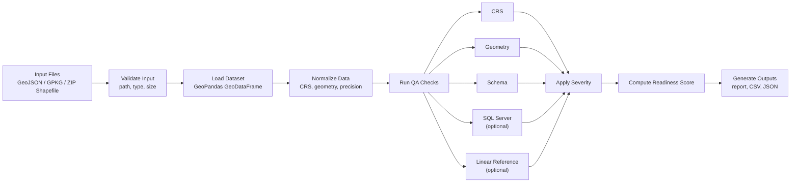

# GeoQA Agent

GeoQA Agent validates geospatial files, normalizes their geometry and CRS, runs deterministic QA checks, assigns severity, computes a readiness score, and writes a report plus issue CSV.


## Pipeline Gates And Watch Mode

GeoQA can block bad data before ingestion instead of only reporting after the fact.

```bash
python app.py path/to/dataset.zip --output-dir outputs/gates --fail-below 85
```

`--fail-below` writes the normal QA artifacts, adds a `pipeline_gate` result to the JSON output, and exits with code `2` when the readiness score is below threshold. A GitHub Actions workflow is included at `.github/workflows/geoqa-gate.yml`.

For folder drops, run watch mode:

```bash
python app.py --watch-dir /data/incoming --output-dir outputs/watch --watch-once --fail-below 85
```

Continuous watch mode can poll a folder and optionally send Slack alerts when readiness falls below threshold. See `docs/pipeline_gate_and_watch.md`.

## Why GeoQA Agent?

GIS and infrastructure teams often discover data quality problems too late: during database loading, dashboard development, spatial joins, or model execution.

GeoQA Agent runs deterministic spatial QA checks before downstream use.

It helps identify:

- missing or inconsistent CRS/SRID
- invalid, null, or empty geometries
- duplicate geometries
- mixed geometry types
- polygon overlaps
- schema issues
- SQL Server compatibility risks
- linear referencing issues

The output is an evidence-backed QA package:

- Markdown report
- issue CSV
- run summary
- run record
- append-only run log

## V1 Product Complete

V1 is the first real product target for GeoQA Agent: a deployed dataset-readiness MVP for GIS and infrastructure teams.

V1 lets an analyst:

- run QA on GeoJSON, GPKG, or zipped shapefile data
- optionally reproject to a target CRS/SRID such as `EPSG:4326` or `EPSG:3857`
- review deterministic findings in plain language
- generate grounded agent reports, fix plans, and handoff summaries
- approve or reject AI-assisted outputs
- export a handoff bundle for downstream teams

V1 deployment uses:

- Vercel web UI and API for upload, run status, and artifact downloads
- Supabase for production upload/run/artifact persistence
- Python worker container for heavy GeoQA processing
- Streamlit on a stateful host for deeper internal analyst/operator workflows

V1 docs:

- [V1 release notes](docs/v1_release_notes.md)
- [V1 deployment guide](docs/v1_deployment.md)
- [V1 production MVP guide](docs/v1_production_mvp.md)
- [V1 Centreline case study](docs/v1_case_study_centreline.md)
- [V1 glossary](docs/v1_glossary.md)

Canonical V1 demo command:

```bash
python app.py demo/input/centreline_intersections_sample.zip --output-dir demo/output --agent-run --agent-task report --agent-max-steps 4 --llm-provider static --static-report-file demo/output/static_v4_report.md --approve-agent-report --reviewer-name "Demo Reviewer"
```


## First Revenue Version

GeoQA's first revenue product is the **GeoQA Data Readiness Audit**: a paid per-dataset or per-project QA package for GIS and infrastructure teams.

It helps teams avoid failed GIS data loads, find spatial anomalies before dashboards break, and create evidence-backed handoff packages for downstream engineering, GIS, or stakeholder review.

Starting offer:

- Starter audit: `$249` per dataset
- Project audit: `$1,500-$5,000` for 5-20 datasets
- Pilot audit: `$3,000-$7,500` for a 2-4 week readiness pilot

Revenue artifacts include:

- `customer_report.md`
- `customer_intake.json`
- `qa_report.md`
- `issues.csv`
- `summary.json`
- `run_record.json`
- `geometry_profile.json`
- optional `handoff_bundle.zip`

First-revenue guide: [GeoQA Data Readiness Audit](docs/first_revenue_audit.md)

## Project flowchart



## Architecture at a glance

1. `app.py` parses the CLI request and forwards runtime options into `geoqa.runner.run_geoqa(...)`.
2. `geoqa/ingestion` validates the incoming file and loads it into a GeoPandas `GeoDataFrame`.
3. `geoqa/normalization` optionally reprojects CRS, repairs invalid geometries, and snaps precision to a grid.
4. `geoqa/checks` runs deterministic QA rules across CRS, geometry, schema, SQL Server compatibility, and linear referencing.
5. `geoqa/severity` maps issue codes to severities and suggested fixes, while `geoqa/scoring` computes a readiness score.
6. `geoqa/reporting` writes the run artifacts and `geoqa/ops/run_logger.py` appends an operational log entry.

## Supported inputs

- `.geojson`
- `.gpkg`
- zipped shapefile

## Quick start

```bash
python app.py path/to/data.geojson --required-column asset_id
```

Artifacts are written to `outputs/<run_id>/`:

- `qa_report.md`
- `issues.csv`
- `run_record.json`
- `summary.json`

## Demo case study

The repo includes a small Centreline Intersections demo package that shows GeoQA on a realistic geospatial QA workflow.

- Demo input: [centreline_intersections_sample.zip](demo/input/centreline_intersections_sample.zip)
- Sample report: [qa_report.md](demo/output/qa_report.md)
- Sample issues: [issues.csv](demo/output/issues.csv)
- Demo notes and Loom script: [demo_notes.md](demo/demo_notes.md)

Run the demo:

```bash
python app.py demo/input/centreline_intersections_sample.zip --output-dir demo/output
```

The committed sample output shows a `needs_review` result for a 50-feature Centreline sample. GeoQA flags duplicate point geometries and null-heavy elevation fields, then turns those findings into a readiness score, suggested fixes, and shareable report artifacts.

## Agent-assisted reports in V0.2

V0.2 adds an optional evidence-backed AI report layer on top of the deterministic QA engine.

The deterministic QA artifacts remain the source of truth. Every LLM-generated sentence must be grounded in:

- `summary.json`
- `issues.csv`
- `run_record.json`
- retrieved fix playbook text

See the release summary: [docs/v0.2_release_notes.md](docs/v0.2_release_notes.md)

### What V0.2 adds

- OpenAI-first LLM gateway
- Fake/static gateway for tests and offline demos
- Prompt registry
- Local RAG fix playbooks
- Agent report draft generation
- Report consistency validation
- Hallucination monitoring
- Human review and approval workflow
- Final AI report generation only after approval
- Minimal Streamlit interface

### V0.2 demo command

Copy and run:

```bash
python app.py demo/input/centreline_intersections_sample.zip --output-dir demo/output --agent-run --agent-task report --agent-max-steps 4 --llm-provider static --static-report-file demo/output/static_v4_report.md --approve-agent-report --reviewer-name "Demo Reviewer"
```

This path uses the bundled static gateway, so it works without an API key. Live OpenAI-backed generation is also supported by setting `OPENAI_API_KEY` and `GEOQA_LLM_MODEL` and using `--llm-provider openai`.

The agent layer supports:

- prompt selection with `--agent-prompt`
- review states in `review_status.json`: `draft_ready`, `blocked`, `rejected`, `approved`
- later review of an existing run with `--review-output-dir`

Approve an existing draft without regenerating it:

```bash
python app.py --review-output-dir demo/output --approve-agent-report --reviewer-name "Demo Reviewer" --review-notes "Approved after review"
```

Reject an existing draft:

```bash
python app.py --review-output-dir demo/output --reject-agent-report --reviewer-name "Demo Reviewer" --review-notes "Needs revision before approval"
```

### V0.2 artifacts

- Deterministic report: [demo/output/qa_report.md](demo/output/qa_report.md)
- Deterministic issues: [demo/output/issues.csv](demo/output/issues.csv)
- AI draft: [demo/output/agent_report_draft.md](demo/output/agent_report_draft.md)
- AI final report: [demo/output/agent_report.md](demo/output/agent_report.md)
- Consistency check: [demo/output/report_consistency.json](demo/output/report_consistency.json)
- Hallucination monitor: [demo/output/hallucination_check.json](demo/output/hallucination_check.json)
- Review status: [demo/output/review_status.json](demo/output/review_status.json)
- Review history: `review_history.jsonl` in each run folder

### GitHub preview

Deterministic report preview:


Issues CSV preview:


Terminal run preview:


### Product claim

GeoQA produces evidence-backed AI reports, not free-form AI summaries.

Run the minimal Streamlit UI:

```bash
streamlit run streamlit_app.py
```

The Streamlit app supports deterministic QA runs, static demo-mode draft generation, consistency and hallucination inspection, review actions, and artifact downloads in one page.

## Production run path in V2.1

V2.1 hardens the existing V2 workflow for single-host internal deployment.

### Runtime configuration

Use `.env.example` as the base configuration. The production config layer supports:

- `OPENAI_API_KEY`
- `GEOQA_LLM_MODEL`
- `GEOQA_OUTPUT_ROOT`
- `GEOQA_AGENT_REPORT_ENABLED`
- `GEOQA_OPENAI_TIMEOUT_SECONDS`
- `GEOQA_OPENAI_MAX_RETRIES`
- `GEOQA_OPENAI_RETRY_BACKOFF_SECONDS`

Validate runtime configuration before first use:

```bash
python app.py --diagnose-config
```

### Container deployment

Build and run the single-host deployment:

```bash
docker compose up --build
```

The default Streamlit endpoint is `http://localhost:8501`.

Persistent storage strategy:

- mount `./outputs` to preserve runtime artifacts
- keep `review_status.json` as the current review state
- keep `review_history.jsonl` as the append-only review audit trail

### Operations runbook

See [docs/v2.1_operations.md](docs/v2.1_operations.md) for build, env, storage, and retention guidance.


## V3 analyst workflow

V3 turns GeoQA into an analyst workflow product on top of the deterministic QA and evidence-backed agent report layers.

V3 adds:

- recent-run browsing through `run_index.jsonl`
- saved run comparisons with stable comparison keys
- deterministic fix-plan generation with playbook grounding
- handoff bundle export with completeness validation
- paged issue triage in Streamlit instead of full issue JSON dumps

### V3 full analyst CLI flow

```bash
python app.py demo/input/centreline_intersections_sample.zip --output-dir demo/output --agent-run --agent-task report --agent-max-steps 4 --llm-provider static --static-report-file demo/output/static_v4_report.md --reviewer-name "Demo Reviewer" --approve-agent-report
python app.py --review-output-dir demo/output --generate-fix-plan
python app.py --compare-run-dir demo/output_previous --target-run-dir demo/output
python app.py --review-output-dir demo/output --export-handoff-bundle
```

### V3 workflow artifacts

- `run_index.jsonl`
- `fix_plan.md`
- `fix_plan.json`
- `comparison_index.json`
- `comparisons/<comparison_key>/comparison_summary.json`
- `comparisons/<comparison_key>/comparison_report.md`
- `bundle_manifest.json`
- `handoff_bundle.zip`

## V4 real OpenAI agent runtime

See [docs/v4_release_notes.md](docs/v4_release_notes.md) for this release summary.

V4 upgrades GeoQA from draft generation into a real OpenAI-backed, tool-using analyst agent.

V4 adds:

- a bounded agent session runtime for `report`, `fix_plan`, and `handoff` tasks
- an internal GeoQA-only tool surface for evidence loading, issue paging, comparisons, remediation, and handoff export
- `agent_session.json` for session metadata and runtime state
- `agent_trace.json` for ordered tool calls and prompt context
- a first-class `Run Agent` workflow in Streamlit
- backward-compatible `--agent-report` support routed through the new `report` agent task
- V4 primary CLI path is `--agent-run --agent-task ...`; `--agent-report` is compatibility mode

### V4 agent CLI flow

```bash
python app.py demo/input/centreline_intersections_sample.zip --output-dir demo/output --agent-run --agent-task report --agent-max-steps 4 --llm-provider static --static-report-file demo/output/static_v4_report.md --approve-agent-report --reviewer-name "Demo Reviewer"
```

You can also run the new tasks against an existing reviewed run:

```bash
python app.py --review-output-dir demo/output --agent-run --agent-task fix_plan --llm-provider static --static-report-file demo/output/static_v4_report.md
python app.py --review-output-dir demo/output --export-handoff-bundle
```

### V4 agent artifacts

- `agent_session.json`
- `agent_trace.json`
- `agent_report_draft.md`
- `agent_report.json`
- `report_consistency.json`
- `hallucination_check.json`
- `review_status.json`
- `review_history.jsonl`
- `agent_report.md` only after approval

### V4 Streamlit flow

```bash
streamlit run streamlit_app.py
```

The Streamlit console now lets analysts:

- run deterministic QA
- run the agent for `report`, `fix_plan`, or `handoff`
- inspect session status, tool trace, and validation results
- review drafts and finalize approved reports
- compare runs, generate remediation, and export handoff bundles

## Checks in v1

- CRS presence and coordinate plausibility
- geometry validity, empties, duplicates, mixed types, overlaps, suspicious feature sizes
- required schema columns, null-heavy columns, duplicate feature IDs
- optional SQL Server compatibility checks
- optional linear reference checks

## Vercel production MVP upload workflow

GeoQA now includes a Vercel Python web UI and API backend:

- [vercel.json](vercel.json)
- [api/index.py](api/index.py)

Available routes include:

- public: `/`, `/health`, `/config`
- authenticated: `/api/v1/uploads`, `/api/v1/runs`, `/api/v1/runs/{run_id}`, `/api/v1/runs/{run_id}/review`, `/api/v1/runs/{run_id}/artifacts`

Notes:

- `/` renders the upload dashboard for `.geojson`, `.gpkg`, and zipped shapefile inputs, including an optional target CRS/SRID reprojection field.
- `/health` and `/config` remain public JSON endpoints for deployment checks.
- upload-created runs remain queued until the Python worker claims and processes them.
- V1.1 supports direct Supabase upload sessions and gated 1 GB large-file mode.
- `/api/v1/*` requires `x-api-key` when `GEOQA_API_KEY` is configured.
- Run processing follows `queued -> running -> completed|failed`.
- Streamlit remains the primary local/stateful operator console in this phase.

Deployment guide: [docs/vercel_deploy.md](docs/vercel_deploy.md) and [docs/v1_production_mvp.md](docs/v1_production_mvp.md)
